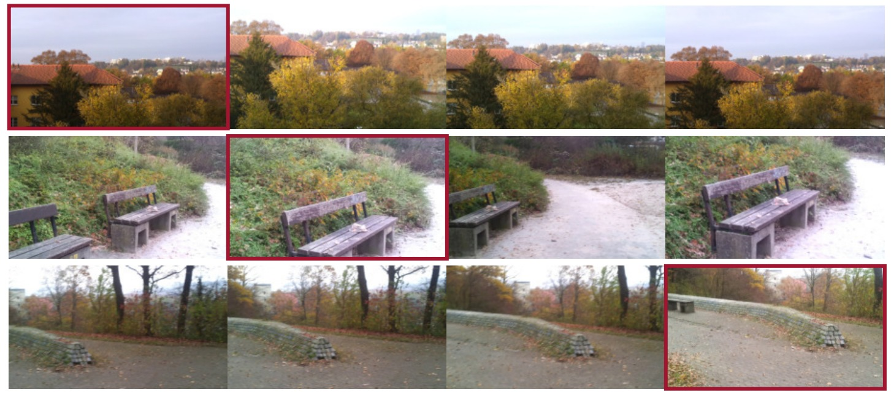

# Will People like Your Image?

TensorFlow implementation of estimating image aesthetics

**Will people like your image**<br>
Katharina Schwarz Patrick Wieschollek, Hendrik P.A. Lensch<br>
*WACV 2018*

<p align="center">  </p>

## Training

The original model was trained on an out-dated TensorFlow training interface. Here, we provide a multi-GPU training script based on TensorPack.
For more details, see the training directory.

## Video Spotting

We provide an example to do video spotting. The steps are:

```console
user@host $ VIDEO=original.mp4
user@host $ avconv -i original.mp4 -s 256x256 -strict -2 echo ${VIDEO%.mp4}-small.mp4  # resize the video to match the network input
user@host $ python apply.py --mp4 ${VIDEO%.mp4}-small.mp4 # apply our neural network
user@host $ python gui.py # use the GUI to display the video and the scores
```

Click `Load Video` and select the original high-res video.

## Training Data

The file `arod/list.txt` provides the url to images used during training. The format is `url;faves;views`.

